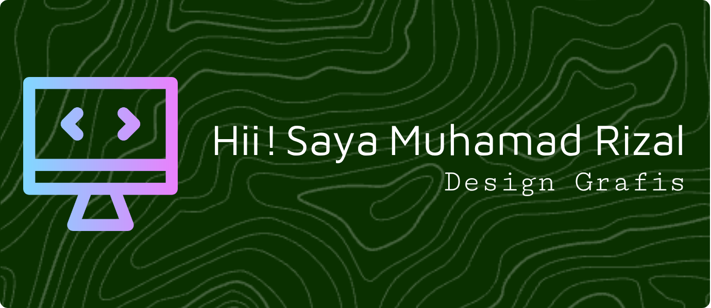

## Hi there 👋

Saya adalah seorang desainer grafis yang berpengalaman dan memiliki keahlian khusus dalam merancang desain untuk apparel seperti kaos, jaket, hoodie, dan varsity. Dengan perpaduan kreativitas dan pemahaman tren fashion terkini, saya mampu menghadirkan desain yang unik, menarik, dan sesuai dengan identitas brand atau kebutuhan klien.

**Apa yang Membuat Saya Berbeda:**
- Telah menangani lebih dari 100+ desain apparel untuk komunitas kreatif.
- Mampu mengerjakan desain siap cetak (print-ready) dengan pemahaman teknis seputar sablon dan bahan kain.
- Terbiasa bekerja dalam deadline tanpa mengurangi kualitas desain.

### 🖍 Skills

        
         
         
         
        

     

### Portofolio
**Mockup Design**

      

      
    

